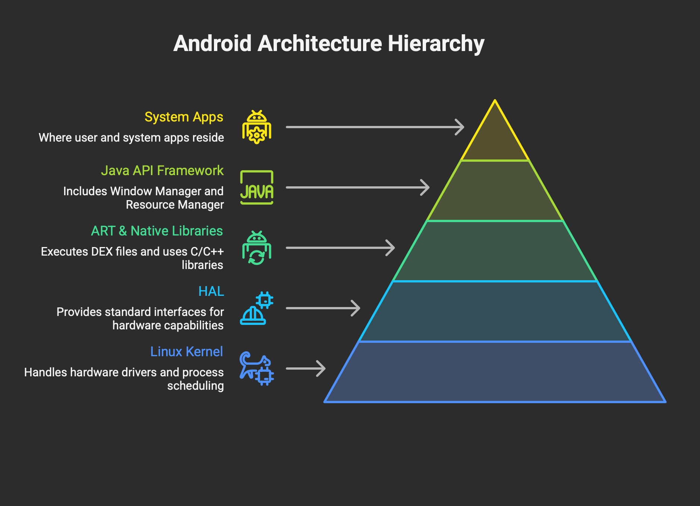

# 🏗️ Android Architecture (Refined HLD + LLD View)




### 1. Linux Kernel (Core Isolation Layer)

- This is the base of everything. 
- Modified version of Linux, tailored for mobile hardware
- This is not just “drivers”—it’s the **security + process isolation backbone**.

**Key responsibilities:**

- It manages the most fundamental things: 
  - memory allocation
  - running multiple processes at once
  - battery/power control
  - file system
- Contains device drivers for camera, Wi-Fi, touchscreen, USB, audio
- Each app runs with a unique UID → enforced at kernel level
- No direct memory sharing → all cross-app comm via Binder IPC


### 2. HAL (Hardware Abstraction Layer)

- Acts as a **contract layer** between hardware vendors and Android framework.
- Instead of every app needing to know the specific details of your phone's camera hardware, they just ask the Camera HAL, which handles the specifics. 
This is how Android can run on thousands of different devices — swap out the HAL for a different phone's hardware, and everything above stays the same.

**Why it matters:**

* OEMs implement HAL → Android remains device-agnostic
* Framework calls HAL via **Binderized interfaces (HIDL/AIDL)**

**Example:**

Camera API → CameraService → HAL → Vendor driver

### 3. Android Runtime (ART) + Native Libraries(the engine room)

- This layer has two side-by-side parts. 
- The **Android Runtime (ART)** is what actually runs your apps 
   - it takes the compiled app code (in a format called DEX) and executes it.
- The **Native C/C++ Libraries** are pre-built, 
   - highly optimized tools for things like rendering graphics (OpenGL), 
   - playing media, storing data (SQLite), and 
   - rendering web pages (WebKit). 

- Apps access these through the layer above.

- **Zygote** preloads core classes → reduces app startup latency

#### Native Libraries (C/C++)

```
libc, SSL, SQLite, OpenGL, Web rendering
```
**Interview trap:**

JNI misuse → major **security + performance risk**


### 4. Java API Framework (System Services Layer)

- This is what app developers actually code against. 
- It gives them ready-made building blocks: 
  - the Activity Manager (controls screens and navigation), 
  - Notification Manager, 
  - View System (all the buttons, text fields, layouts), 
  - Content Providers (sharing data between apps), and much more.
- Every app is essentially assembling these components together.
- Abstracts all the complexity of runtime and hardware into simple APIs

**Key concept:**

- Apps NEVER talk to services directly
- Everything goes through **Binder IPC**

### 5. System Apps / User Apps Layer

- Pre-installed apps + third-party apps
- Run in **sandboxed processes**
- Communicate via:
  - Intents
  - Binder
  - Content Providers


# 🔍 Deep Process Flow (App Launch Internals)


<iframe src="android_app_launch_flow.html" width="100%" height="450px" style="border:none; border-radius: 8px; margin: 1.5rem 0;"></iframe>


Here's a quick summary of all 8 steps:

1. **Step 1 — Tap**: Launcher detects touch, creates an Intent with the app's package name, sends it to the system.
2. **Step 2 — AMS**: ActivityManagerService receives the Intent, checks if an app process already exists — it doesn't (cold start).
3. **Step 3 — Zygote fork**: AMS tells Zygote to fork() — a pre-warmed copy of ART is instantly cloned as the new app process.
4. **Step 4 — ART init**: Android Runtime loads the app's DEX bytecode and compiles it (JIT/AOT) inside the new process.
5. **Step 5 — Application.onCreate()**: First app code runs — global SDKs, crash reporters, DI containers initialise.
6. **Step 6 — Activity.onCreate()**: Your screen's Activity starts — layout is declared via setContentView(), ViewModels wired up.
7. **Step 7 — View inflation**: XML layout is parsed, every View object created, then measure → layout → draw passes render the frame.
8. **Step 8 — SurfaceFlinger**: The frame is composited with the status bar and nav bar, then pushed to the display.


# ⚡ Critical Concepts (Must Mention in Interviews)

## 1. Zygote (Performance Optimization)

* Preloaded classes + resources
* Uses **fork() → copy-on-write**
* Reduces cold start latency


## 2. Binder IPC (Most Important Topic)

**Why it matters:**

* Core communication mechanism in Android

**Flow:**

```
App → Binder Proxy → Kernel Driver → System Service → Response
```

**Key properties:**

* Fast (shared memory + kernel mediation)
* Secure (UID/PID verification)


## 3. System Server (Brain of Android)

* Runs all major services
* Single point of failure → guarded heavily

## 4. Sandbox + Security Model

* UID-based isolation
* SELinux policies
* Permission enforcement at multiple layers:

  * Manifest
  * Runtime
  * Binder


# 🔐 Security Mapping to Architecture (Very Important)

| Layer     | Security Role          |
| --------- | ---------------------- |
| Kernel    | UID isolation, SELinux |
| HAL       | Vendor trust boundary  |
| ART       | Memory safety, GC      |
| Framework | Permission enforcement |
| Apps      | Least privilege model  |


## 🎯 Senior-Level Interview Answer (Polished)

> Android follows a layered architecture. At the base is the Linux Kernel, which provides process isolation, memory management, and security using UID sandboxing and SELinux. Above it is the HAL, which abstracts hardware details from the framework. The Android Runtime (ART) executes DEX bytecode using AOT and JIT compilation, supported by native libraries written in C/C++.
>
> The Java API Framework exposes system services like ActivityManager and WindowManager, which apps interact with via Binder IPC. At the top, system and user apps run in isolated sandboxes and communicate through controlled mechanisms like Intents and Content Providers.
>
> App startup is optimized using the Zygote process, which preloads classes and forks new app processes efficiently.

---

# 🚨 Common Mistakes Candidates Make

* Ignoring **Binder IPC**
* Not mentioning **Zygote**
* Treating HAL as optional
* Missing **System Server role**
* Weak understanding of **security boundaries**

---