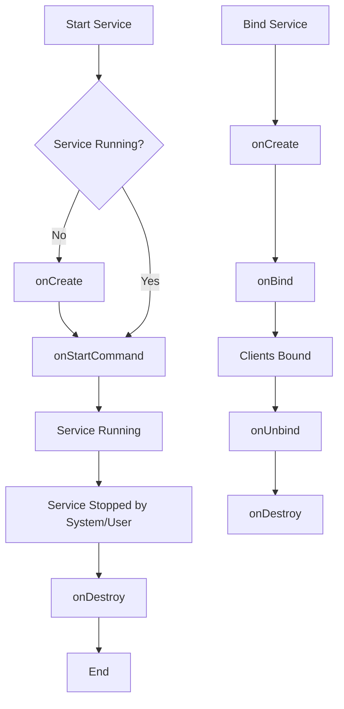

# Services

A **Service** is an application component that can perform long-running operations in the background. It does not provide a user interface. Once started, a service might continue running for some time, even after the user switches to another application.

---

# 🧠 Types of Services

Android provides three main types of services, each optimized for different background tasks:

## 1. Foreground Service
Performs operations that are noticeable to the user.
*   **Requirement**: Must display a **Status Bar Notification** to keep the user aware that the service is running.
*   **Priority**: High. The system will not kill it even when memory is low.
*   **Use Case**: Playing music, fitness tracking (GPS), or an ongoing phone call.

```kotlin
// Example: Starting a Foreground Service
val intent = Intent(this, MusicService::class.java)
ContextCompat.startForegroundService(this, intent)
```

## 2. Background Service
Performs operations that aren't directly noticed by the user.
*   **Restriction**: Since Android 8.0 (API 26), background services are heavily restricted. Apps should use **WorkManager** for most background tasks.
*   **Use Case**: Syncing data with a server or compressing files in the background.

```kotlin
// Example: Starting a Background Service
val intent = Intent(this, MyBackgroundService::class.java)
startService(intent)
```

## 3. Bound Service
Allows components (like Activities) to bind to the service and interact with it.
*   **Mechanism**: It offers a client-server interface that allows components to send requests and get results.
*   **Lifecycle**: It runs only as long as another application component is bound to it.
*   **Use Case**: An Activity interacting with a local database through a Service.

```kotlin
// Example: Binding to a Service
val intent = Intent(this, LocalService::class.java)
bindService(intent, connection, Context.BIND_AUTO_CREATE)
```

### 🎬 Interactive Mechanism Walkthrough

<iframe src="service_mechanism.html" width="100%" height="450px" style="border:none; border-radius: 8px; margin: 1.5rem 0;"></iframe>

---

# ⚙️ How Services Work Internally

### 1. The "Main Thread" Myth
> [!WARNING]
> A Service **runs on the Main Thread** of its hosting process by default. It does **not** create its own thread and does **not** run in a separate process unless specified. You must create a new thread (or use Coroutines/WorkManager) if you are performing CPU-intensive or blocking work.

### 2. Lifecycle Methods
The system manages the service through specific callback methods:

*   `onCreate()`: Called when the service is first created. Used for one-time setup.
*   `onStartCommand()`: Called every time a client starts the service using `startService()`.
*   `onBind()`: Called when a component wants to bind to the service. Returns an `IBinder` object.
*   `onDestroy()`: Called when the service is no longer used and is being destroyed.


▶ Started Service Flow

```text
onCreate()
   ↓
onStartCommand()  (can be called multiple times)
   ↓
onDestroy()
```

▶ Bound Service Flow

```text
onCreate()
   ↓
onBind()
   ↓
onUnbind()
   ↓
onDestroy()
```

▶ Mixed (Started + Bound)

```text
onCreate()
   ↓
onStartCommand()
   ↓
onBind()
   ↓
onUnbind()
   ↓
(onDestroy only when both stop + unbind happen)
```

### 3. Service "Sticky" Modes
The integer returned by `onStartCommand()` tells the system how to handle the service if the OS kills it to reclaim memory:

| Mode | Behavior |
| :--- | :--- |
| **`START_STICKY`** | Recreates the service but does **not** redeliver the last intent. Good for music players. |
| **`START_NOT_STICKY`** | Does **not** recreate the service unless there are pending intents to deliver. |
| **`START_REDELIVER_INTENT`** | Recreates the service and **redelivers** the last intent. Good for file downloads. |

---

# 🔍 Process Flow: Lifecycle


.....explaination ??

---
### 🚀 Interview-Level Summary

`onCreate()` → called once

`onStartCommand()` → can be called multiple times

`onBind()` → establishes IPC channel

`onDestroy()` → final cleanup

Service runs on main thread unless you offload work

Lifecycle depends on:

    Start mode

    Binding state
    
    System constraints

---

# 🎯 Interview-Ready Answer

**Q: What is the difference between a Service and a Thread?**

**Answer:**
> A **Service** is an Android component representing the intent to perform work in the background. It is managed by the Android System and can survive even if the Activity is destroyed. 
> 
> A **Thread** is a lower-level OS execution unit. 
> 
> **Key Point**: A Service is NOT a thread. By default, it runs on the Main Thread. You should use a Thread (or Coroutine) *inside* a Service to avoid blocking the UI.

**Q: Why use WorkManager instead of a Background Service?**

**Answer:**
> Background Services are restricted in modern Android to save battery. **WorkManager** is the recommended solution because it is **persistent** (survives app restarts) and **system-aware** (respects battery saver, Doze mode, and charging status).

---

# 🔗 Summary Table: Which one to use?

| Use Case | Recommended Component |
| :--- | :--- |
| Immediate, user-visible task (Music) | **Foreground Service** |
| Task that must complete (Upload) | **WorkManager** |
| Inter-process communication | **Bound Service** |
| Short UI task (Animation) | **Thread / Coroutine** |
