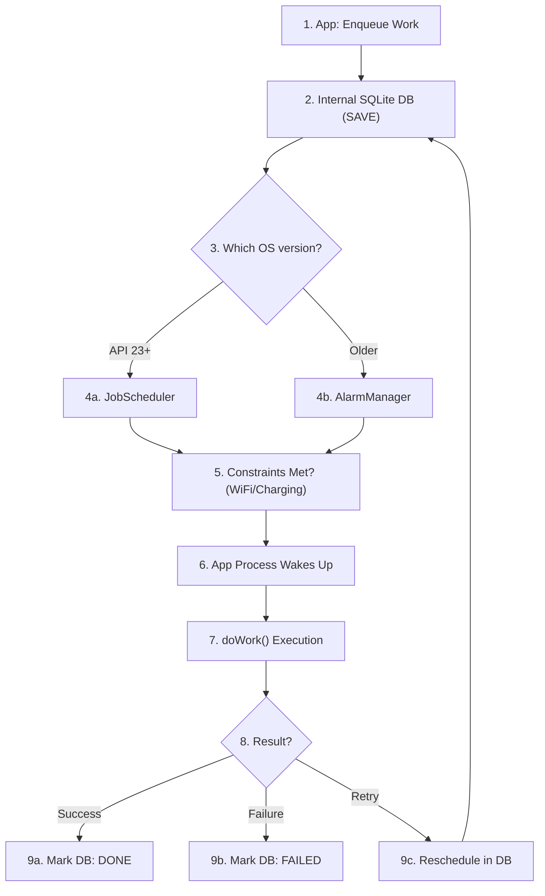

# WorkManager

**WorkManager** is the recommended Android library for persistent work. It is part of Android Jetpack and provides a unified API for tasks that are **deferrable** (don't need to run immediately) and **guaranteed** (must run even if the app exits or the device reboots).

---

# 🧠 Core Idea: Reliability Abstraction

WorkManager is not a background service itself. Instead, it is an **orchestrator** that manages background work by choosing the best way to run it based on the device's API level and state.

> [!IMPORTANT]
> The "magic" of WorkManager lies in its **internal SQLite database**. Every work request you enqueue is first saved to disk. This is why it can survive process death and reboots.

### 🎬 Interactive Mechanism Walkthrough

<iframe src="workmanager_mechanism.html" width="100%" height="450px" style="border:none; border-radius: 8px; margin: 1.5rem 0;"></iframe>

---

# 🛠️ Work Types

WorkManager supports two primary types of work requests:

### 1. OneTimeWorkRequest
A task that runs exactly once.
*   **Use Case**: Uploading a single image, processing a specific file.
*   **Chaining**: Can be chained with other tasks (`workA.then(workB)`).

### 2. PeriodicWorkRequest
A task that runs repeatedly on a cycle.
*   **Interval**: Minimum interval is **15 minutes**.
*   **Flexibility**: You can define a "flex period" to specify exactly when within the interval the work should run.
*   **Use Case**: Daily data sync, periodic log cleanup.

---

# ⚙️ Full Mechanism: How it works Internally

The following flow explains how WorkManager guarantees execution:

### 1. The Enqueue Phase
When you call `workManager.enqueue(request)`:
1.  **Persistence**: WorkManager immediately writes the `WorkRequest` details (constraints, data, retries) into its **internal SQLite database**.
2.  **State**: The work state is set to `ENQUEUED`.

### 2. The Scheduling Phase
WorkManager's **Scheduler** checks the device API level and delegates the task:
*   **API 23+**: Uses **JobScheduler**. It tells the OS: "Hey, run this job when these constraints (e.g., WiFi + Charging) are met."
*   **API < 23**: Uses a combination of **AlarmManager** and **BroadcastReceivers** to "wake up" the app and run the work.

### 3. The Execution Phase
When constraints are met:
1.  The system (JobScheduler/AlarmManager) triggers WorkManager.
2.  WorkManager initializes your `Worker` class on a **background thread** (default is `Dispatchers.Default` for `CoroutineWorker`).
3.  `doWork()` is executed.

### 4. The Resolution Phase
Based on the `Result` returned from `doWork()`:
*   **Result.success()**: Work state updated to `SUCCEEDED` in DB.
*   **Result.failure()**: Work state updated to `FAILED`.
*   **Result.retry()**: WorkManager uses **Exponential Backoff** to reschedule the work in the DB.

---

# 🔗 Internal Architecture: Step-by-Step

To guarantee that work is never lost, WorkManager follows a strict "Persistence-First" workflow.

### 1. The Internal Flow Chart



---

### 2. The Mechanism in Plain Language

| Step | Phase | What happens behind the scenes? |
| :--- | :--- | :--- |
| **1** | **Enqueue** | You tell WorkManager to do something (e.g., "Upload this photo"). |
| **2** | **Persist** | **Critical Step:** WorkManager immediately saves your request into a local **SQLite Database**. Even if your phone dies 1 second later, the task is now "on disk." |
| **3-4** | **Schedule** | WorkManager checks your Android version. It picks the best "alarm clock" available (JobScheduler for new phones, AlarmManager for old ones) to handle the task. |
| **5** | **Monitor** | The system waits. It checks: Is the user on WiFi? Is the phone charging? It won't start until your conditions are perfect. |
| **6-7** | **Execute** | Once conditions are met, the system wakes up your app and runs your `doWork()` code on a background thread. |
| **8-9** | **Resolve** | Your code finishes. WorkManager looks at the result: <br>• **Success**: Deletes the task from the database. <br>• **Retry**: Keeps it in the database and sets a new timer to try again later. |

---

# 💻 Code Example: Reliable Upload

```kotlin
// 1. Define the Worker
class UploadWorker(appContext: Context, workerParams: WorkerParameters):
    CoroutineWorker(appContext, workerParams) {
    
    override suspend fun doWork(): Result {
        return try {
            val fileUri = inputData.getString("uri")
            uploadFile(fileUri) // Your logic
            Result.success()
        } catch (e: Exception) {
            if (runAttemptCount < 3) Result.retry() else Result.failure()
        }
    }
}

// 2. Enqueue with Constraints
val constraints = Constraints.Builder()
    .setRequiredNetworkType(NetworkType.UNMETERED) // WiFi only
    .setRequiresCharging(true)
    .build()

val uploadRequest = OneTimeWorkRequestBuilder<UploadWorker>()
    .setConstraints(constraints)
    .setInputData(workDataOf("uri" to "content://path/to/file"))
    .setBackoffCriteria(BackoffPolicy.EXPONENTIAL, 10, TimeUnit.MINUTES)
    .build()

WorkManager.getInstance(context).enqueue(uploadRequest)
```

---

# 🎯 Interview-Ready Answer: "The Guarantee"

**Q: How does WorkManager guarantee that a task will run even if the device reboots?**

**Answer:**
> WorkManager guarantees execution by using a **Persistence Layer**. When a task is enqueued, it is saved into an internal **SQLite database**. 
> 
> After a reboot, WorkManager receives a `BOOT_COMPLETED` broadcast (internally handled), checks its SQLite database for pending tasks, and reschedules them with the system's `JobScheduler`. Because the state is stored on disk, the task is never lost even if the process is killed or the battery dies.

---

# ⚖️ When NOT to use WorkManager

| Scenario | Use instead... |
| :--- | :--- |
| Tasks that must run **immediately** | **Coroutine / Thread** |
| User-visible tasks (Audio/Navigation) | **Foreground Service** |
| Task that doesn't need to survive app kill | **Coroutine / Thread** |
