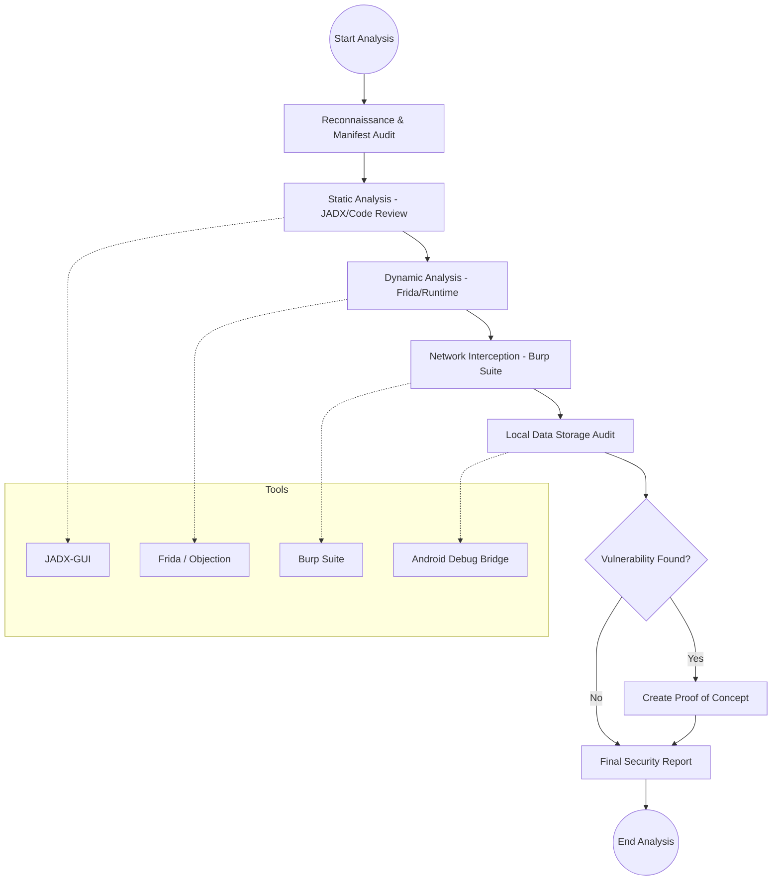

# Mobile Application Security Analysis Process
*As a Google Mobile Security Engineer*

This document outlines the standard, rigorous process for auditing and analyzing Android applications to ensure they meet Google's security standards and protect user data.

---

## 1. Information Gathering & Reconnaissance
The first step is to understand the "surface area" of the application.
- **Package Metadata:** Identify the package name, version, and target SDK.
- **Permission Audit:** Analyze requested permissions in `AndroidManifest.xml` for over-privilege (e.g., `READ_SMS`, `QUERY_ALL_PACKAGES`).
- **Dependency Check:** Scan for known vulnerabilities in third-party libraries (SDKs).

## 2. Static Application Security Testing (SAST)
Analyzing the code without executing it.
- **Decompilation:** Using tools like `jadx` or `apktool` to recover source code and resources.
- **Manifest Review:** Identifying exported `Activities`, `Services`, and `BroadcastReceivers` which might be vulnerable to unauthorized access.
- **Hardcoded Secrets:** Searching for API keys, hardcoded credentials, or private keys.
- **Insecure Implementations:** Checking for weak cryptographic algorithms (e.g., AES/ECB) or insecure `WebView` settings (e.g., `setJavaScriptEnabled(true)` without origin checks).

## 3. Dynamic Application Security Testing (DAST)
Observing the app's behavior during runtime.
- **Runtime Instrumentation:** Using **Frida** or **Xposed** to hook into methods and bypass security controls like Root Detection or SSL Pinning.
- **Sensitive API Monitoring:** Tracking calls to location, contacts, and camera to ensure they match the app's stated purpose.
- **Input Fuzzing:** Sending malformed data via `Intents` or `Deep Links` to check for crashes or logic flaws.

## 4. Network Traffic Analysis
Intercepting and inspecting the data leaving the device.
- **Interception:** Routing traffic through a proxy like **Burp Suite** or **Mitmproxy**.
- **Privacy Check:** Ensuring PII (Personally Identifiable Information) is encrypted and not leaked in URL parameters or logs.
- **API Security:** Testing for Broken Object Level Authorization (BOLA) or weak session management.

## 5. Local Storage & Data Privacy
Investigating how data is stored on the device.
- **Sandbox Inspection:** Checking `/data/data/[package_name]` for sensitive data in `SharedPrefs`, SQLite databases, or internal cache.
- **External Storage:** Ensuring no sensitive data is stored on the SD card where other apps can access it.

## 6. Exploitation & Reporting
- **Proof of Concept (PoC):** Attempting to exploit identified vulnerabilities to determine real-world impact.
- **Classification:** Mapping findings to the **OWASP Mobile Top 10**.
- **Remediation:** Providing clear, actionable guidance to developers to fix the flaws.

---

## Analysis Workflow Flowchart

