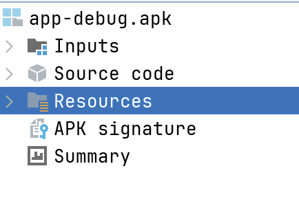
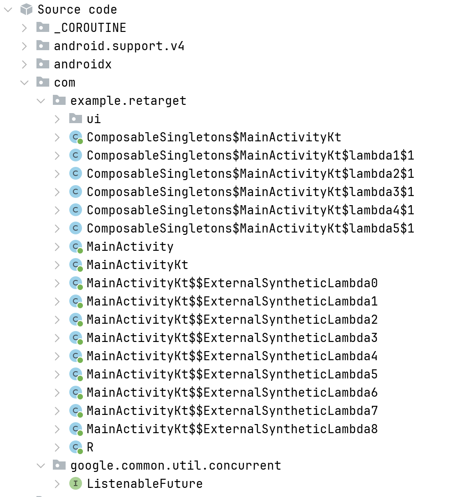
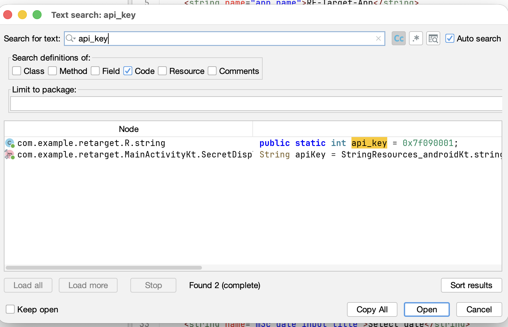
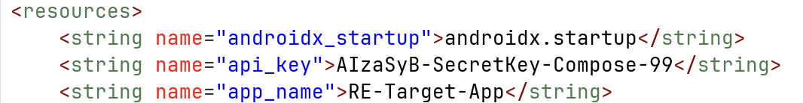

# Reverse Engg A App Using JADX tool

## Prerequisites

- JADX tool
- APK file

## Steps

1. Open JADX tool
2. Load APK file
3. Analyze the code
4. Understand the app structure
5. Identify key components
6. Analyze security vulnerabilities

## Download JADX tool

https://github.com/skylot/jadx/releases

for macOS 

```sh
$ brew install jadx
```

than to launch gui

```sh
$ jadx-gui
```


This guide shows how to reverse-engineer an APK manually using JADX, focusing on how a security researcher or penetration tester would approach it in a real scenario.

---

## 🛡️ Case A vs. Case B: Which one are you reversing?

Before you start, identify if the app is "clean" or "hidden."

### ✅ Case A: No Obfuscation (The Easy Way)
The code is readable, names are clear (e.g., `LoginActivity`), and the structure makes sense. 
**[Follow the guide below for Case A]**

### 🔐 Case B: With Obfuscation (The Hard Way)
The code is scrambled, names are single letters (e.g., `a.b.c`), and strings are encrypted.
**[Click here to follow the specialized guide for Case B](./reverseEnggObfuscated.md)**

---

# Case A: Standard Reverse Engineering Workflow


### Step 1: Download the APK

You need the target APK file first. You can get it in several ways:

*   Pull from your own device: `adb pull /data/app/<package_name>/*.apk`
*   Use an APK extractor app.
*   Download from third-party stores (not recommended for production apps).

For this guide, assume you have a file named `app-debug.apk`.

---

### Step 2: Launch JADX GUI

```sh
$ jadx-gui
```

This opens the JADX GUI application, which has three main panels:

1.  **Left Panel**: Package tree (resources and code structure).
2.  **Middle Panel**: Code view (decompiled Java code).
3.  **Right Panel**: Resource viewer.

---

### Step 3: Load the APK into JADX

*   Click **File** → **Open**.
*   Select your `app-debug.apk` file.
*   JADX will automatically start decompiling and indexing the APK.

---

### Step 4: Analyze the App Structure (Project Tree)

The **Left Panel** organizes the decompiled APK into logical sections:

*   **`Source code`**: Decompiled Java/Kotlin logic.
*   **`Resources`**: Android resources like `strings.xml` and `AndroidManifest.xml`.
*   **`APK signature`**: Displays the signing certificate details.
*   **`Summary`**: High-level overview (Package name, SDK versions).



---

### Step 5: Navigating the Source Code

Expand the **`com`** folder. Most of what you see initially are libraries (`androidx`, `kotlin`, etc.). Look for the folder that matches your app's package name.

In our example: **`com` -> `example` -> `retarget`**

### Common Jetpack Compose Structure:
*   **`ui/theme`**: Styling and colors.
*   **`LoginScreenKt`**: The logic for the login UI.
*   **`MainActivityKt`**: The main app content.
*   **`MainActivity`**: The entry point that hosts the Compose UI.



---

### Step 6: Analyze `AndroidManifest.xml`

Located in **Resources** -> **`AndroidManifest.xml`**. This is the "Master Blueprint" of the app.

Pay attention to:

```xml
<manifest xmlns:android="http://schemas.android.com/apk/res/android" package="com.example.retarget">

    <uses-permission android:name="android.permission.INTERNET" />

    <application ...>
        <activity android:name="com.example.retarget.MainActivity" android:exported="true">
            <intent-filter>
                <action android:name="android.intent.action.MAIN" />
                <category android:name="android.intent.category.LAUNCHER" />
            </intent-filter>
        </activity>
    </application>
</manifest>
```

Look for:
*   `android:exported="true"`: Means the activity can be started by other apps (potential entry point).
*   `uses-permission`: Lists what the app can access (Camera, Internet, etc.).

---

### Step 7: Decompile and Analyze Logic

#### 1. Check for Hardcoded Secrets

Press `cmd + shift + F` opens a search box search for
apikey or password or secret key

If you see a hex value like `0x7f090001` instead of a string:



*   **What it is**: A reference to `strings.xml`.
*   **How to solve**: Click the ID or search for it in `Resources` -> `resources.arsc` -> `res/values/strings.xml`.



#### 2. Look for "If" Statements (Logic Gates)
Logic is almost always a comparison. Search for:
*   `.equals("...")`
*   `if (isRooted)`
*   `if (password.isValid())`

#### 3. Trace Method Calls
If you find a suspicious method like `checkLicense()`, right-click it and select **Find Usage**.

---

### Step 8: Identify Attack Surfaces

If this were a pentest, you would:
1.  **Bypass Login**: Can you change a boolean in the code to `true`?
2.  **Intercept Traffic**: Use Burp Suite to see what the app sends to its API.
3.  **Root Detection**: See if the app stops working on rooted devices.

---

### Step 9: Exporting for Further Analysis

*   **Export XML**: Right-click resource folder -> **Export all resources**.
*   **Save as Project**: **File** → **Save all as project** (allows you to open the code in Android Studio).
