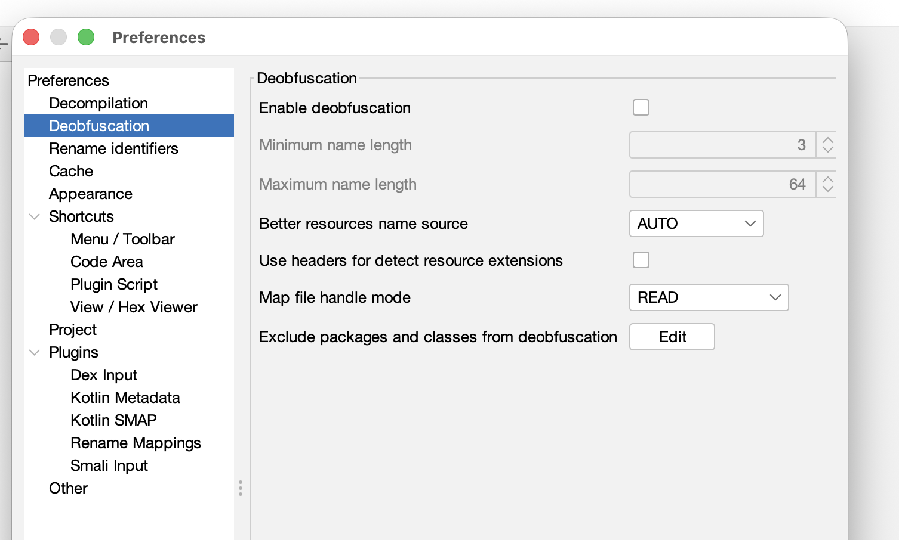

# Reverse Engineering Obfuscated Apps (Case B)

Reversing an obfuscated app (processed by R8 or ProGuard) is like solving a puzzle where all the pieces are blank. The logic is there, but the names are gone.

> [!NOTE]
> If your app has clear names (like `LoginActivity`) and an organized package structure, you are in **Case A**. 
> **[Click here for the Case A (Standard) Guide](./reverseEnggApp.md)**

---

### Step 1: Identifying Obfuscation
You know you are in "Case B" if:
*   **Alphabet Soup**: Most classes/methods are named `a`, `b`, `c`, `d`.
*   **Package Flattening**: All files are in a single package (e.g., `a.a.a`).
*   **No Source Reference**: The code doesn't tell you which `.java` file it came from.

---

### Step 2: Use JADX Deobfuscation Mode
Before you start reading, let JADX help you stabilize the names.

1.  Open the **Preferences** dialog:
    
    *(Go to File -> Preferences or click the gear icon in the toolbar)*

2.  Navigate to the **Deobfuscation** tab:
    

3.  **Enable deobfuscation**: This renames everything short (`a`, `b`) to unique names (`ClassA`, `MethodB`).
4.  **Minimum name length (Set to 3)**: This ensures only very short, obfuscated names are changed.

**Why do this?** 
Without this, searching for a variable named `a` would give you 10,000 results. With deobfuscation, you can search for `ClassA` and find exactly what you need.

---

### Step 3: Finding a "Hook" (The Entry Point)
Since you can't search for "LoginButton," you have to find it using Resource IDs.

1.  **Find the UI element ID**: Go to `Resources` -> `res/layout` or `strings.xml` and find the ID for the button you want to track (e.g., `0x7f090005`).
2.  **Search the ID**: Search for that hex value in the source code.
3.  **Trace the Listener**: This will lead you to a method like:
    ```java
    button.setOnClickListener(new ClassA(this));
    ```
4.  Open `ClassA`. The code inside its `onClick` method is the logic you are looking for.

---

### Step 4: The "Rename as You Go" Technique
This is the most important skill in reversing obfuscated code.

1.  **Analyze a Method**: You find a method `a(String s)` that does `SharedPreferences.putString("key", s)`.
2.  **Rename It**: Right-click the method and select **Rename** (or press **`N`**).
3.  **Name it something useful**: Rename it to `saveToPrefs`.
4.  **Watch the magic**: JADX updates that name **everywhere** in the app. Suddenly, other files that call `saveToPrefs` start making sense!

---

### Step 5: Look for "Tell-Tale" Signatures
Even if names are gone, **Android System Calls** cannot be obfuscated. Search for:
*   `getSharedPreferences` (Data storage)
*   `HttpURLConnection` / `OkHttpClient` (Networking)
*   `getSystemService("device_policy")` (Security/Root checks)
*   `Ljava/lang/reflect/Method;` (Reflection - often used to hide behavior)

---

### Step 6: Dealing with String Encryption
If you see garbage like `a.b("kfj#9$")`, the app is encrypting its strings.
*   **The Shortcut**: Look at the `a.b` method. If it returns a String, JADX can sometimes execute it for you (if it's simple) or you can copy the logic into a separate Java file to "decrypt" all the strings yourself.

---

### Summary Checklist for Obfuscated Apps:
- [ ] Enabled JADX Deobfuscation mode.
- [ ] Found the target UI Resource ID.
- [ ] Traced the UI ID to a class or listener.
- [ ] Renamed at least 5-10 methods to make the flow readable.
- [ ] Identified the networking or storage logic.
